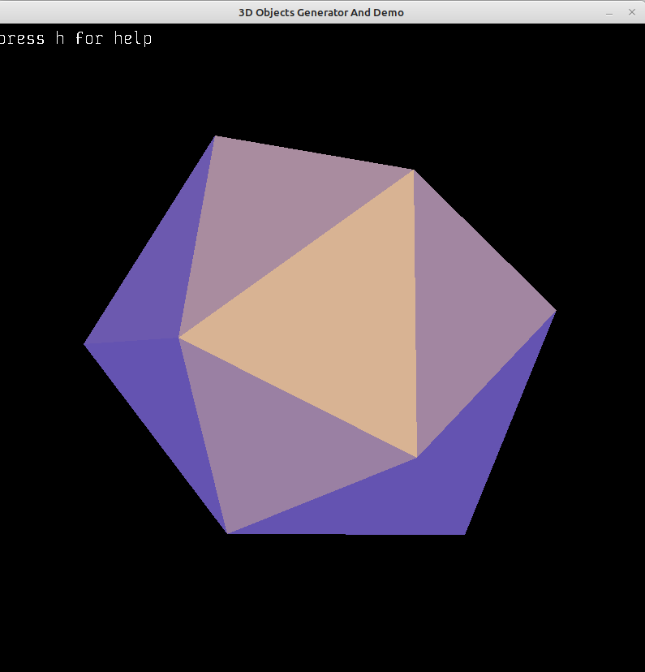

# 3D objects generator

I started this project to have 3d objects for my Amiga 500 vector graphics renderer.

There are two apps:

- generator
- viewer 

run.sh is example script which generates several objects and show them in the viewer

Needed to build these libraries (in the brackets there are versions I've tested):

- SDL2 (2.0.18)
- SDL2 image (2.8.2)
- SDL2 ttf (2.0.18)
- boost (1.71)
- cmake (3.16)
- g++ (C++17)

## Generator usage manual

Objects can be created by defining main object type (using --t option) and additional component objects. Please look below for details.

Please look into run.sh file to see how they are defined.

### Main object types that can be created:

1. Cube
- params (--a): size (default 50)

_--a option can be avoided and values can be written immediately after type name_

2. CubeExt - cube made of component objects located on each face 
- component name used on each face (--c)
- component params (--p): _depends on used component_
- face params (--f): translation-x translation-y translation-z (default 0 0 0)

_Value in f and p can be negative_

3. Thorus 
- params (--a): circle-amount ring-amount circle-radius circle-offset

_--a option can be avoided and values can be written immediately after type name_

- sinus params (--s): circle-step-x circle-amp-x circle-step-y circle-amp-y circle-step-z circle-amp-z ring-step-x ring-amp-x ring step-y ring-amp-y ring-step-z ring-amp-z

block:
bss - size of verticles in block
bsx - step
bax - amp


- prefer triangle faces over rectanges or other kind (--3): no values

_--s contains value of double type_

4. Composite - currently the most flexible object that can be made of 6 different components, moved and rotated
- component name (--c0, --c1, --c2, --c3, --c4, --c5): _if component is not defined in this app then an object file with given name is searched_
- component creation params (--p0, --p1, --p2, --p3, --p4, --p5): _depends on created component, see --p in components
- component transformation params (--t0, --t1, --t2, --t3, --t4, --t5): available params are: 
    - rotation degrees (rx, ry, rz)
    - translation (tx, ty, tz)

_Value in f and p can be negative_

5. Tetrahedron
- params (--a): circle-radius height

_--a option can be avoided and values can be written immediately after type name_

6. RegularTetrahedron
- params (--a): circle-radius

_--a option can be avoided and values can be written immediately after type name_

7. FractalTetrahedron 
- params (--a): circle-radius

_--a option can be avoided and values can be written immediately after type name_

### Components which can be used in CubeExt and Composite:
1. Square, name: square
--p size (default: 50)
2. Rectangle, name: rectangle
--p size-x size-y (default: 50 50)
3. Pyramid, name: pyramid
--p size height (default: 50 20)
4. Taper, name: taper
--p circle-amount circle-radius height (default: 3 50 50)
5. Cylinder made of squares, name: cylinder
--p circle-amount cirlce-radius height (default: 3 50 50)
6. Cylinder made of triangles, name: cylindertriangles
--p circle-amount cirlce-radius height (default: 3 50 50)
7. CSign made of half of a circle, name: csign
--p number-of-points circle1-radius circle2-radius circle1-x-offset circle2-x-offset width (default: 3 50 50 0 0 10)

### Build on MS Windows
Install MSYS2, use MSYS2 UCRT64 shell:
```
pacman -S --needed base-devel mingw-w64-ucrt-x86_64-toolchain 
pacman -S ucrt64/mingw-w64-ucrt-x86_64-cmake
pacman -S ucrt64/mingw-w64-ucrt-x86_64-SDL2
pacman -S ucrt64/mingw-w64-ucrt-x86_64-SDL2_image
pacman -S ucrt64/mingw-w64-ucrt-x86_64-SDL2_ttf
pacman -S ucrt64/mingw-w64-ucrt-x86_64-boost
```


